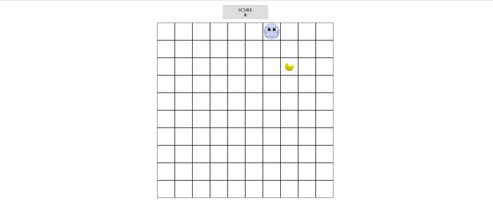

<h1> Furry-Game </h1>

<h3> General Information </h3>

 Game created using Vanilla Javascript. 

 Controling  Furry using keyboards arrows and collecing coins.

https://pmatyjas.github.io/Furry-Game/

<<<<<<< HEAD
<h3> Technologies </h3>

 JavaScript 

=======
https://pmatyjas.github.io/Furry-Game/

>>>>>>> 3c05a4366970339fd353fc8d81a1576397fd97de

<h3> Screenshot </h3>

